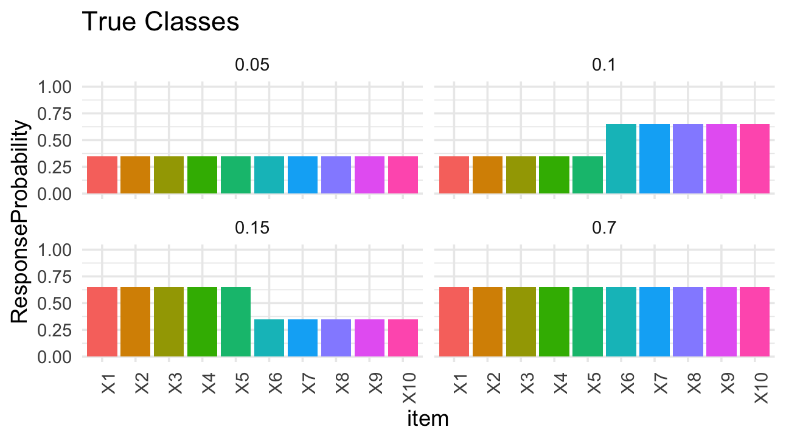
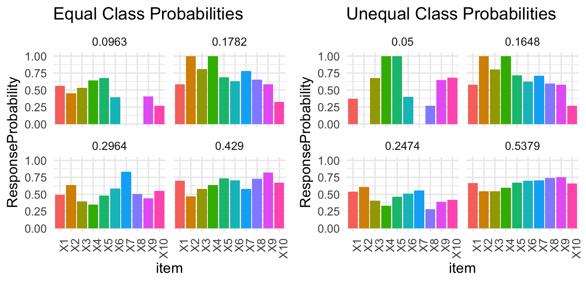

```{r setup, include=FALSE}
knitr::opts_chunk$set(echo = TRUE)
library(tidyverse)
library(poLCA)
library(kableExtra)
```

### Introduction
This post assumes familiarity with latent class models. [Here] is an intro if you aren't. 
When estimating latent class models, starting values are needed to get the estimation algorithm going. When I first learned about latent class models, I came across this R package [poLCA](https://github.com/dlinzer/poLCA)

### Motivation

```{r, echo = FALSE, fig.align = 'center', out.width = '70%', results = 'markup'} 

```


```{r, echo = FALSE, fig.align = 'center', out.width = '80%', results = 'markup'} 

```

First off, let's get one thing out of the way. Neither of these two models 

### What I Did


### Results 


### Conclusion


