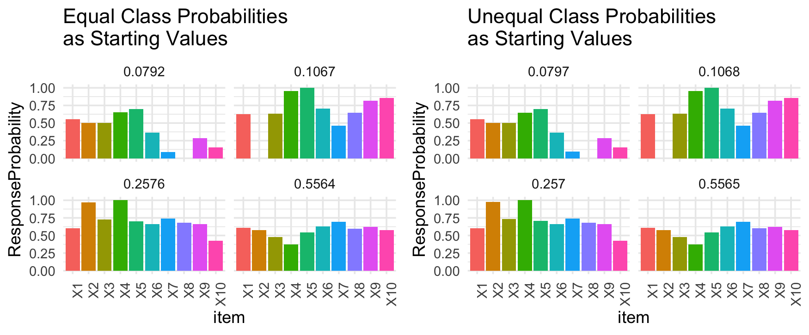

```{r setup, include=FALSE}
knitr::opts_chunk$set(echo = TRUE)
library(tidyverse)
library(poLCA)
library(kableExtra)
```

### Introduction
This post assumes familiarity with latent class models. When estimating latent class models, starting values are needed to get the estimation algorithm going. When I first learned about latent class models, I came across this R package [poLCA](https://github.com/dlinzer/poLCA) which allows for latent class models to be estimated very easily. After 30 minutes of poking around I was able to use the package to estimate a simple latent class model. All of the parameter estimates and model fit information are easy to access and you can even plot the class solutions in a 3D bar graph using one of the functions in the package! 

It wasn't until a year or so later during graduate school where I became interested in estimation. Expectation-maximization (EM) algorithm is the most common algorithm for estimating latent class models, and is what is used in the poLCA package. After understanding the basic gist of the EM algorithm I was always curious about how it was actually implemented, but other software like STATA and MPLUS do not have publicly accessible code. That's why I started looking into the code for poLCA which is open-source and able to be viewed directly on github. That's when I noticed that while there was code to randomly generate item response probabilities from a uniform distribution or provide user input for item response probabilities, there wasn't that option for the latent class prevalence probabilities. The default was that the starting latent class prevalence probabilities were evenly split by the number of classes estimated. For example, if 4 classes are estimated, then the starting value probabilities for each class is .25. 
    
### Motivation

That got me thinking...would this default specification of equal latent class sizes for the starting value have an impact on estimation? Around this time I was starting to think about how estimation of latent class models could vary: what makes them easy or challenging to estimate? Conversations with my advisor helped me develop some hypotheses about challenging estimation conditions such as small sample sizes and items with high measurement error. Unbalanced latent class proportions came up as a factor worth examining, since smaller classes means that there are fewer observations in the dataset that will contribute information to the model when estimating parameters for that smaller class. 

Having unbalanced latent class prevalences (such as 4 classes with prevalences of .75, .12,.08,.05) is [common in alcohol research](http://doi.org/10.1016/j.drugalcdep.2015.11.035), where high or frequent substance use represents a smaller proportion of the population. In a simulation study examining the impacts of misspecification on class enumeration, the authors found that compared to data generated from a two class model with 50%/50% membership in the two classes, class enumeration indices (used for deciding the optimal number of classes to fit the data) performed worse when the two classes had a 80%/20% membership instead. This research shows support for the idea that unbalanced class sizes impact the estimation process and the final solution. 

Now returning back to the issue of starting values. Say we have data generated from a latent class with unbalanced class sizes, making it very likely to have a complicated likelihood surface (aka more challenging to find the best parameters that describe the data). If we start our estimation algorithm with starting values where the classes are equally sized, will the algorithm struggle to find the optimal parameter values? When estimation latent class models we most often follow the principles of maximum likelihood estimation. Given our observed data that we have (response patterns to a set of items), we choose the set of parameter values, item response probabilities and latent class prevalences, that maximize the likelihood of observing the data. I like to think of the likelihood as a vast landscape with lots of hills and valleys. We want to find the location of the highest peak, which represents the set of parameter values that correspond to the best likelihood, but we might get stuck at a lower peak and call it a day there instead. These estimation algorithms might stop at what is believed to be the highest peak, but it reality it is not. This is called reaching a local solution, rather than the maximum solution. So my question is, by starting our algorithm in a location that is a bit further from the true parameter values (aka further away from the highest peak), will the algorithm be more likely to land on a local solution? If that is the case, then maybe we could propose a way to allow for unbalanced class size estimates to be used as starting values rather than *only* equal class sizes. 


### What I Did
What I did was quite simple. I copied the main poLCA function from the package's github and modified a small chunk of the code so that the user could specify whatever latent class prevalence values they wanted for the initialization of the algorithm, rather than only always using equal class sizes. Here's what I wanted to test: if I gave the same dataset and item response probability starting values to two versions of poLCA, one where the latent class starting values are equal, and one where they are not equal, would they both reach the same solution? 

I only used one dataset in this example, and so more datasets should be done in order to have a definitive answer, but nonethless I think these initial results can be illuminating.

```{r, echo = FALSE, fig.align = 'center', out.width = '70%', results = 'markup'} 
knitr::include_graphics("Rplot1.png")
```

The graph above shows the parameters used to generate the dataset. These are the true values that we hope to recover from fitting our model. Each of the bars represents the probability of saying "no" to a particular item. The graph in the upper left hand corner shows the solution for class 1. .05 is the latent class prevalence, this means that 5% of our sample is estimated to be part of this class. Based at looking at the bars, in this class individuals have a 35% of saying "no" to all items X1-X10 in this simulated fake data example. If we translate this to a substance use example just for kicks, let's say that items X1-10 ask whether someone has consumed different types of substances such as alcohol, marijuana, cocaine, etc., with one drug for each question. Because individuals in this class have a low probability of saying no to each of these items, we might label this class as "high substance use". This class only represents 5% of our population, which could track with what we see in real world research with smaller populations of poly-substance users. The class on the bottom right would represent "low substance use", as shown by high probability of saying "no" to all of the items X1-X10. 
This class represents 70% of the entire sample, which is a large majority! The other two classes show varying response patterns and highlight the heterogeneity in responses.


### Results 

```{r, echo = FALSE, fig.align = 'center', out.width = '80%', results = 'markup'} 
knitr::include_graphics("Rplot.png")
```

So I ran two models. One model with equal latent prevalence probabilities (.25,.25,.25,.25) for starting values, and the other model with unequal latent prevalence probabilities (.7,.15,.1,.05). Both models had the exact same starting values for the item response probabilities. The results after estimation are shown in the figure below. Based on just looking at the top most graph on both the equal and unequal models, we can see some differences in the final solution. When using equal class probabilities as the starting value, we see that the chance of saying "no" for item X1 is 56%, while on the other hand when we use unequal class probabilities, the chance of saying "no" for item X1 is 37%. This difference in parameter values would change the interpretation of the class. The first solution suggests individuals in this class are likely to say "no" for item X1, while the second solution suggests the opposite! A similar situation arises for items X9 and X10 for the same class! Notice that these large differences between start value method only occurs in the smallest latent class. This goes back to what I mentioned earlier about smaller classes being harder to estimate due to limited information!

Which solution is better? Based on looking at the likelihood value, where we aim to choose the solution with the largest likelihood value, we would go with the solution produced by starting with equal latent class prevalence probabilities. Does this mean all of this was moot and that starting with equal probabilities is always the way to go? Not yet...


When fitting latent class models, the issue of algorithms getting stuck on local solutions rather than the maximum is well known. Thus, textbooks and articles about best practices for latent class models frequently suggest running many iterations with varying starting values, and then choosing the solution with the largest likelihood value. So given that my earlier exploration was just one iteration, let's ramp it up to 1000 iterations. For each method of starting values, equal and unequal latent class prevalence probabilities, we will run the model 1000 times (making sure that both methods have the same set of 1000 sets of item response probability starting values), and choose the best solution for each of the methods and compare. This way aligns more closely with how researchers would actually fit these models. It is possible that despite some differences in solutions, the overall best solution found by the two methods over 1,000 iterations might just be the same.


```{r, echo = FALSE, fig.align = 'center', out.width = '80%', results = 'markup'} 

```

Lo and behold, the best solution found by both methods over 1,000 iterations yielded the same solution! There are some slight differences in the parameter estimates but they are beyond the thousandths decimal place so for practicality I will say that they're the same solution. So that's interesting! One important thing I wanted to highlight is that these solutions are pretty far away from the true data generating parameters! Despite the similarity in the final solution between the two methods, these results highlight the difficulties of estimating this model with this dataset. This dataset not only has item response probabilities with high measurement error, but only has a sample size of 400, which is smaller than the recomended number for fitting latent class models!

We've established in this example that the overall final solution doesn't differ much, but I'm still curious about whether there are some differences iteration by iteration between the two methods. If so, is there one method that tends to find better solutions over the other? I made two tables that compare how many times one method was superior to the other when they both used the exact same set of item response probability starting values over the 1,000 iterations.

```{r, echo = FALSE, message = F,warning = F}
library(kableExtra)
df <- data.frame(
  Description = c(
    "% of iterations where both fail to converge",
    "% of iterations where equal class probabilities fail but unequal doesnt",
    "% of iterations where unequal class probabilities fail but equal doesnt"
  ),
  Value = c(14, 19, 24)
)

df %>%
kbl(caption = "Comparing Convergence Between Start Value Methods") %>%
  kable_classic(full_width = F, html_font = "Cambria")
```

Before we can compare solutions, we should look at convergence first. Not all iterations will successfully converge. Failure to converge could be due to the location of the starting values causing the algorithm to get stuck in an area where it cannot improve. As shown in Table 1, we can see that using unequal latent class prevalence probabilites as starting values resulted in slightly higher convergence failures compared to using equal probabilities. 


```{r, echo = FALSE, message = F,warning = F}
df <- data.frame(
  Description = c(
    "% of iterations where equal and unequal class probabilities have same solution",
    "% of iterations where unequal class probabilites has better solution",
    "% of iterations where equal class probabilites has better solution"
  ),
  Value = c(44, 24, 32)
)

df %>%
kbl(caption = "Comparing Solutions Between Start Value Methods") %>%
  kable_classic(full_width = F, html_font = "Cambria")
```
Table 2 compares the solutions found by the two start values method. A better solution in this case is defined by the solution with the higher likelihood value. Almost half of the iterations resulted in the two methods converging to the same solution. When they didn't, the equal probabilities starting values was slightly more likely to find a better solution. 


### Conclusion
I don't think my work in this area is done yet, but the results that I have found so far are interesting. Examining results on a granular level show some differences in solutions when using equal latent class prevalence probabilities as starting values for the algorithm versus using unequal latent class prevalence probabilities. However, the overall best solution out of 1,000 iterations produced by the two methods are the same. Further data conditions and simulations should be run before any strong conclusions are made, but from my perspective I believe the poLCA package should allow users to specify different latent class prevalence probabilities as starting values as an option. Even if it does not ensure a better likelihood solution is found, it could help ensure that the complicated likelihood surface is adequately explored in all of its nooks and crannies (in a high dimensional sense..).

Overall this was super fun to explore and I'm glad I took the time to do a deep dive on an existing package's code! My takeaway message I hope to convey is that estimation is extremely hard and we should thoroughly evaluate all the decisions we make during the estimation process, whether that is how we generate starting values or even which algorithm we choose!

If you've made it this far thanks for reading.


