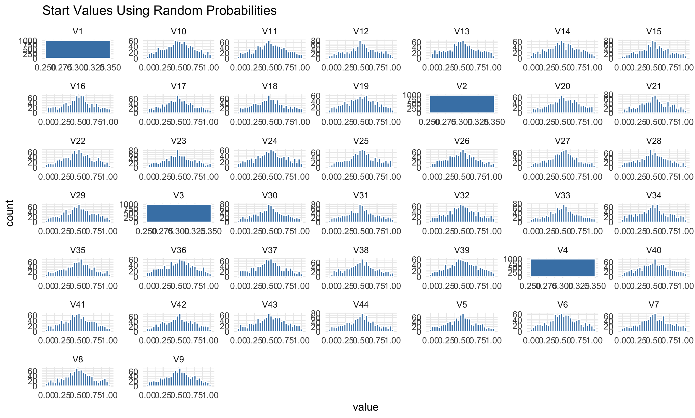
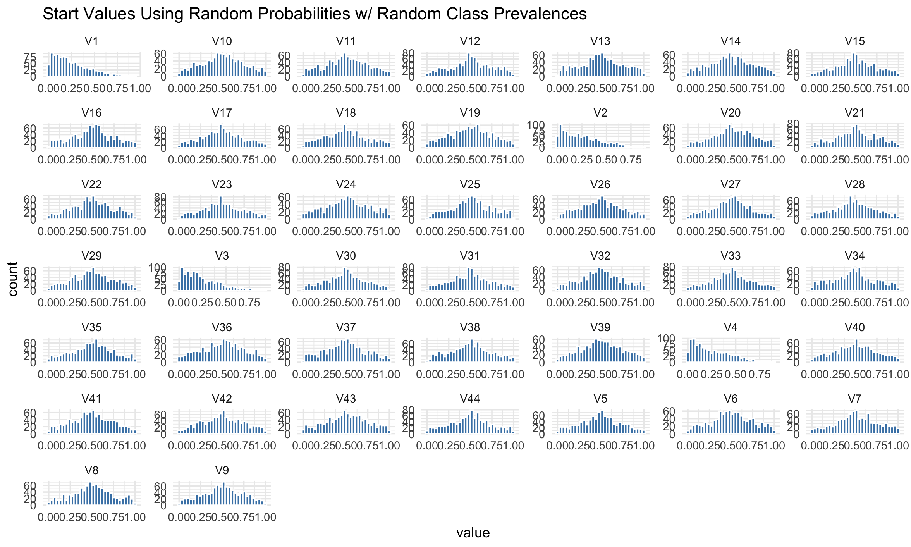
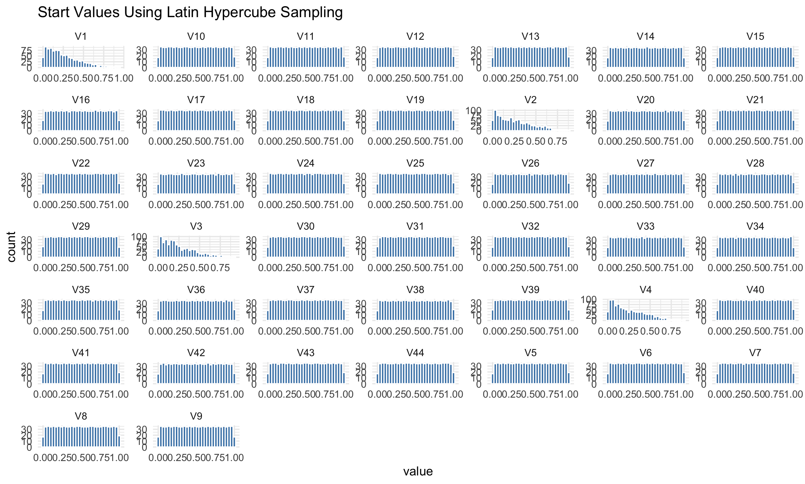
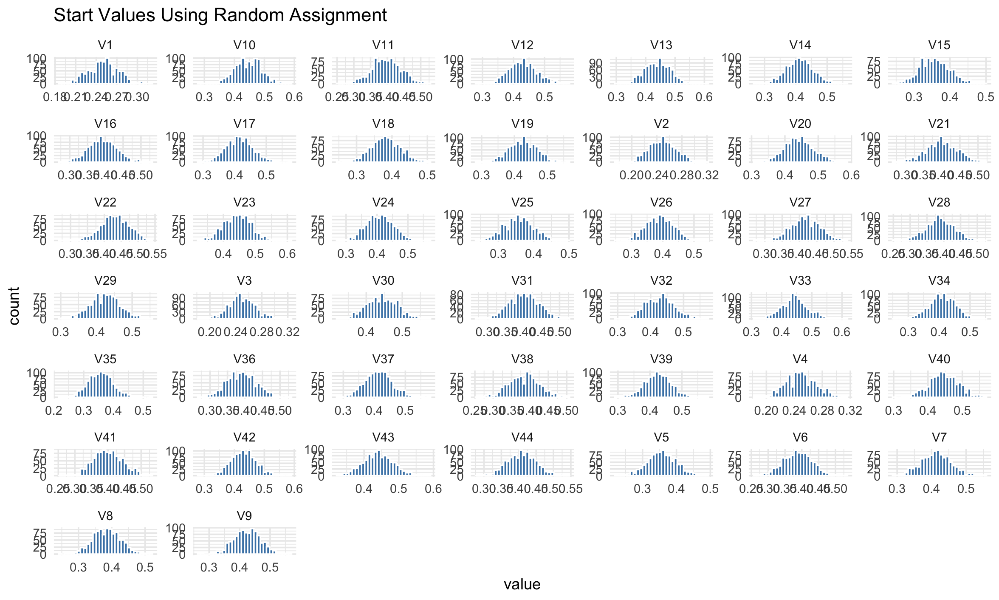

```{r, include = F}
knitr::opts_chunk$set(echo =F)
library(kableExtra)
library(tidyverse)
```

## Introduction

Parameter estimation is the process in which we obtain estimates for parameters that are part of our model of interest, which we then use to describe our population. Linear regression, structural equation modeling, and even just the mean, are examples where there are parameters that must be estimated. My area of research focuses on latent class models, which aim to identify subgroups in a population, where each of the groups differ on some specific latent variable. Each group (or class) has a set of parameters that describe it and differentiate it from another class. These parameters are item response probabilities and latent class prevalences. Item response probabilities tell us: what is the probability that an individual in class X will choose response option Y for item Z? Class prevalence tells us what proportion of the entire sample will be members of class X, as individuals can only be members of one class. We don't know what the true item response probabilities or class prevalences are, so we must estimate them using the observed data we do have, which are individual's responses to items. 
Latent class models are part of the broader family of mixture models, where individuals can be part of a group that has its own characteristics and parameters. These models are notoriously difficult to estimate. While there is more than one framework/perspective to estimation, what I'm talking about today pertains to Maximum Likelihood Estimation (MLE). With MLE, the goal of estimation is to pick values that maximize the probability of observing our data within the context of our model. Maximizing the probability involves choosing parameter values that maximize some function related to our model. In this case our desired function is \begin{equation} 
L(\boldsymbol{\gamma}, \boldsymbol{\rho} \mid \mathbf{y}) 
= \prod_{i=1}^{N} 
\sum_{c=1}^{C} \gamma_c 
\prod_{j=1}^{J} 
\prod_{r_j=1}^{R_j} 
\rho_{j,r_j \mid c}^{I(y_{ij} = r_j)}.
\end{equation} I'm not going to explain this function in detail but this is what we're working with. On a more abstract level- I like to explain estimation as hill-climbing. Our goal is, within a large and vast stretch of land, walk around until we find the hill with the highest elevation, and record our location once we reach it. In other words, we want to explore the entire parameter space and stop at the parameter values (location!) that correspond to the highest value of our function (elevation!). If there's one giant hill and the rest is flat land, we have a pretty high chance of locating that hill, but if there are a bunch of hills, our chances of stopping on a hill that is not actually the highest, but maybe the second or third highest, is much higher. This is what is known in estimation as converging to a local optima/maxima. A local optima is the location of the solution with the highest value in a particular region, but not necessarily the highest value in the entire parameter space. We want the global maximum solution, but oftentimes what our software returns to us is a local maximum. There is no way to tell if we found a local or a global maximum unless you search every corner and crevice of the entire parameter space. In more than 2 dimensions I can't even visualize what the parameter space looks like, but it would be quite complex and hard to do. 

This is why starting values are important. If our parmeter space is super bumpy, rough, and complicated, where you start exploring is highly influential on where you're going to end up. If you only start exploring from one little corner of the parameter space, you're very likely to end up missing out on the true global maximum if it is all the way in the opposite corner. If we start exploring many, many, times (say...1,000+ times), each time starting in a different part of the parameter space.. the highest hill we reach (or in other words the maximum we reach), has a better chance of being the global maximum!

The importance of initializing the algorithm with many starting values has been written many times in [best practice guides](https://www.sciencedirect.com/science/article/pii/S0001879120300701?utm_source=chatgpt.com#s0010), but there is far less research about how exactly to generate those starting values. Expectation-Maximization (EM) algorithm is the most common estimation technique for latent class models, and it guarantees convergence to a local optima, but not necessarily a global optima. Starting values are highly influential for where the algorithm will converge in mixture models. Therefore, there is a recommendation to use many different starting values so that we have a higher chance of finding the global optima rather than settling for a local optima. However, we should think about quality > quantity. Not all starting value generation methods were created equal. A [study](https://link.springer.com/article/10.3758/s13428-015-0697-6) done by Shireman et al. found that using k-means to find start values resulted in less local optima, while using a constrained EM technique found the best solution more often than other start value methods in most conditions. From what I know, there hasn't been any published research that compares start value methods in the context of latent class models. I would love to write a paper on this soon, but for now I'm just going to start small. In this article I will compare a couple of start value methods and what solutions they converged to for a single simulated dataset. 

## Different Start Value Methods
- Random probabilities: This is probably the easiest method. Every parameter in our model is randomly generated from a uniform distribution, meaning that each parameter has equal probability of taking on any values between 0 and 1. This is the method used in the poLCA package in R.

- Random Assignment: Each individual in the sample is randomly assigned to a class. Once all individuals have been assigned to a class, an initial set of item response probabilities are calculated based on who has been assigned to a class. Say hypothetically there are 100 individuals in our data, and all the items we're looking at are binary (0 or 1 responses). 20 of these people have been randomly assigned to class 1. For each item, we will calculate item response probabilities for this class 1 by taking the average of everyone's responses who are in class 1. Let's say from these 20 people, the mean for item 1 is .7. That will be used for the starting value for item 1 class 1. We do this across all items and across all classes to get all of our starting values! This is actually the method I used for my master's thesis simulation study. 

- [Latin Hypercube Sampling?!](https://en.wikipedia.org/wiki/Latin_hypercube_sampling) The name makes the method sound very futuristic and advanced. It is supposedly a more efficient alternative to grid search. Say I have 2 parameters X and Y that both range from 0 to 1. If I want to take 10 random samples from the entire parameter space, I can divide both X and Y into 10 equal chunks (chunk 1: 0-0.1, chunk 2: 0.1-0.2, etc). Sample randomly from each chunk so that we will have a vector of 10 values for X and a vector of 10 values for Y. Shuffle the two vectors so that we have 10 pairs of (X,Y) starting values. This method supposedly covers the parameter space well and is less computationally intensive than grid search. For grid search we would have every single X,Y combination such as (0.01,0.01), (0.01,0.02), (0.01.0.03)...as starting values to use for our algorithm. With 2 parameters this could be done, but with 10 or even 44 parameters (like in the example I will show), this will blow up quickly. 

- There are many other start value methods! K-means clustering has been [suggested](https://pmc.ncbi.nlm.nih.gov/articles/PMC4930421/#S3) as a way to initialize starting values for mixture models, although this is less applicable for latent class model with categorical indicators. In that same article, iteratively constrained EM has also been suggested, where a few iterations of EM are allowed to run for a few steps, before being used as starting values for iterations that are allowed to iterate until they converge. In my personal uneducated opinion this seems a little bit redundant and doesn't seem to address the issue of adequately exploring the parameter space. 

## What I did

Just as a simple thought experiment, I used a dataset that I generated for my master's thesis simulation study. It has a sample of size 400, and the true parameter values that I used to generate responses are shown below.

```{r}
rho_table3 <- tribble(
  ~TrueParameters,     ~Class1, ~Class2, ~Class3, ~Class4,
  "Class Prevalence", 0.70,    0.15, 0.10, 0.05,
  "Item 1",  0.65,    0.65,    0.35,    0.35,
  "Item 2",  0.65,    0.65,    0.35,    0.35,
  "Item 3",  0.65,    0.65,    0.35,    0.35,
  "Item 4",  0.65,    0.65,    0.35,    0.35,
  "Item 5",  0.65,    0.65,    0.35,    0.35,
  "Item 6",  0.65,    0.65,    0.65,    0.35,
  "Item 7",  0.65,    0.65,    0.65,    0.35,
  "Item 8",  0.65,    0.65,    0.65,    0.35,
  "Item 9",  0.65,    0.65,    0.65,    0.35,
  "Item 10", 0.65,    0.65,    0.65,    0.35
)
rho_table3
```

There are 4 classes total, with class 1 being the largest as 70% of the sample belong to that group. With a small sample size, unbalanced class sizes, and high measurement error (an item response probability of .65 means that people have a .35 chance of saying the opposite response), it is highly likely that this model will be hard to estimate. Using this data, I fit latent class models using 4 different start value methods, and did 1,000 iterations for each method. I used the [poLCA package in R](https://github.com/dlinzer/poLCA) with my own modifications to the start values as the structure to collect and store results is super simple to me. poLCA uses EM as the estimation algorithm.

Ultimately, I wanted to see if all start value methods lead to the same overall maximum likelihood solution, and if there was a difference in the number of local solutions found. 

## What I found

```{r}
poLCA_reg <- readRDS("poLCA_reg.Rds")
poLCA_results <- readRDS("poLCA_results.Rds")
poLCA_reg_gam <- readRDS("poLCA_reg_gam.Rds")
poLCA_randomid <- readRDS("poLCA_randomid.Rds")

```
Before I show the maximum liklihood value or the number of local solutions, I wanted to show the spread of starting values that each parameter took on across the 4 start value methods. Since I repeated each start value generation method 1,000 times, there is variability in that actual start values. Our goal is to see an equal spread of values across the 0 to 1 range in order to ensure that all areas of the parameter are explored.

```{r, echo = FALSE, fig.align = 'center', out.width = '320%', results = 'markup'} 

```
The graph above shows the start value spread for all the parameters using random probabilities. Only the item response probability values are randomly generated, and the class prevalences starting values (V1-V4 in the graph) are always set to be 1/C, where C is the number of total classes. In this example where there are 4 classes each starting value for the latent classes is .25. For the item response probabilities you can see a decent spread from 0-1, but there are more values centered around .5 compared to 0 or 1. This method is the default for poLCA.

```{r, echo = FALSE, fig.align = 'center', out.width = '320%', results = 'markup'} 

```
This graph also uses random probabilities (sampled from an uniform distribution) but instead of the class prevalences being fixed, they are sampled from a dirichlet distribution. I chose to sample from dirichlet because the class prevalences need to add up to 1, so sampling from a dirichlet distribution can account for that. You can see that for parameters V1-V4, there is now a spread of probability values. The distribution of the item response probabilities is the same as above. 


```{r, echo = FALSE, fig.align = 'center', out.width = '320%', results = 'markup'} 

```
The graph above shows the spread of parameter values for latin hypercube sampling. Latent class prevalences are also sampled from a dirichlet distribution. The distribution of item response probability start values looks visually different compared to the previous start value methods. There are more starting values closer to 0 and 1 compared to the previous methods, and it resembles more of a uniform distribution. 

```{r, echo = FALSE, fig.align = 'center', out.width = '320%', results = 'markup'} 

```

The last method is random assignment. This spread of starting values is the least uniform. There is a high concentration of starting values around the .4-.5 range. There is virtually no starting values close to 0 or 1. This is a little concerning because this is the start value method I used for my master's work. I had no idea it would be this concentrated in the middle!

Let us not panic yet...while the distribution of the start values may be different, let's see how they impact the results. Turns out, all 4 methods found the same maximum LL value of -2658.298. If you are a regular researcher, that means that regardless of what start value method you used, you'll reach the same solution. That's good. Since I'm a methods researcher, I care a little bit more than just if the same maximum solution is reached. Are they reached the same number of times? What about the solutions that didn't reach the maximum?

```{r}
df <- data.frame(
  Description = c(
    "Latin Hypercube Sampling",
    "Random Probabilities",
    "Random Probabilities w/ Random Prevalences",
    "Random Assignment"
  ),
  Value = c(110, 112, 89,101)
)

colnames(df) <- c("Start Value Method","Frequency of Maximum LL Solution")

df %>%
kbl(caption = "Frequency of Maximum LL Solution Between Start Value Methods") %>%
  kable_classic(full_width = F, html_font = "Cambria")
```

The table above shows the frequency of the maximum LL solution for the various start value methods. While they are reached at relatively similar rates (remember that this is out of 1,000 iterations), there are slight differences. The random probabilities with random prevalences method results in the least amount of iterations reaching the maximum. 

```{r}
df <- data.frame(
  Description = c(
    "Latin Hypercube Sampling",
    "Random Probabilities",
    "Random Probabilities w/ Random Prevalences",
    "Random Assignment"
  ),
  Value = c(63, 34, 100,16)
)

colnames(df) <- c("Start Value Method","Number of Local Solutions Found")

df %>%
kbl(caption = "Comparing Local Solutions Found Between Start Value Methods") %>%
  kable_classic(full_width = F, html_font = "Cambria")
```
Lastly, I want to take a look at the number of local solutions found. This has more variation compared to the frequency of maximum LL solutions. Random Probabilities w/ random prevalences converged to the most local solutions at 100, while random assignment only found 16 local solution. This is quite a big difference. Perhaps having random prevalences, with the possibility of really big or really small classes, allows for exploration of different parts of the parameter space that the random assignment method cannot do. My analysis will end here for today but there is promising future work to be done. Now that we observe differences in the number of local solutions, it would be interesting to look at the parameter estimates of these local solutions, or use the number of local solutions as a predictor for bias or class enumeration (deciding the optimal number of latent classes that fit the data).

## Conclusion

As the sub-title of my article suggests, I really feel like I opened a can of worms in terms of my own research. My master's thesis work is a simulation study comparing convergence behavior between EM and another estimation algorithm called Newton Raphson, and one metric that I use to compare the two are the frequency of local solutions each algorithm finds given the same set of starting values. Well in that work I arbitrarily chose random assignment as the start value generation method without giving it much thought. However, the results here suggest that the start value generation method chosen influences the number of local solutions...so my simulation results are only relevant in the context of the start value method. In my simulation study I did not find the number of local solutions to be a significant predictor of bias (of the final solution), given other simulation factors, but these results might change if I used a different start value method. The method I chose yielded the least amount of local solutions (at least based on this one dataset), while other methods yielded many more! I need to think about the potential implications of this. 

This is super interesting to me and now I want to run my simulation results again but with a different start value method... but where is the time?! If there's one thing to take away from this, is that take start value generation seriously!! Whatever software you're using to estimate models like latent class models, do some digging to see what method they use. 

Thanks for reading. Take care.


